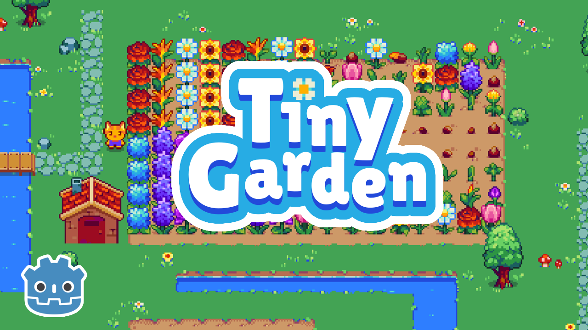

# Make a Tiny Garden game in Godot 4/CodeAlong

Learn to make a Tiny Garden 2D game in Godot. [Watch full tutorial video on YouTube](https://youtu.be/vSwJulHbCW8)! 

➡ Follow me on [Twitter](https://twitter.com/VenexSource) and [YouTube](https://www.youtube.com/@venex_source) for more godot game tutorials, and more!

## What you'll learn
- Build an entire working inventoy system from scratch.
- Learn what Resources are in godot 
- Learn these two concept **Inheritance** and **Composition**(Components), and how to harness them and create better games.
- Design a title screen, a health and coin counter and a lot more.

Feel free to [ open an issue ](https://github.com/venex-source/godot-2D-adventure-platformer/issues) and submit a Pull Request if you find bugs!

## How to get started
1. Download and Install the [Godot Engine](https://godotengine.org/) **(v.4.0 and above)**.
2. Download the [project file]() for the tutorial.
3. Open up the Godot Engine and import the **start** project file. 

We also recommend having a basic understanding of GDScript and a fundamentals of the godot engine. Checkout the [Your First 2D Game](https://docs.godotengine.org/en/stable/getting_started/first_2d_game/index.html) in the official Godot docs, if you haven't already.

## Features
### Player
A basic platformer character that has the ability to:
- Jump
- Stomp on enemies
- Detect Hits
- Collect coins and live(cherry)
### Enemies
- **Frog:** A basic AI enemy that jumps & chase the player once detected, returns to his idle state when player out of range.
- **Opossum:** Basic Patrolling enemy that run's after player if detected and avoids danger(Spike).

### Interface & GUI
- Coin and Health Counter
- Main screen
- Level Transition(Fade-In)

### Keys
**Move** - WASD or Arrow keys
**Jump** - Space bar

## Recommended Video Links
Here is a list of some of the video's i recommeneded in the video.
1. [Introduction to Inheritance in Godot in 5 Minutes](https://youtu.be/1M2k1BoNnXA)
2. [All Collision Object Explained](https://youtu.be/mIlZ0ChAqSw) 

3. [What is Autoload? | Godot Tutorial](https://youtu.be/mIlZ0ChAqSw) 

**Find out more on my YouTube Channel** [Venex Source](https://www.youtube.com/@venex_source)

## Credits
Special thanks to the author's for providing the asset used in this tutorial video. Your creative contribution is greatly appreciated.
- Tiny Garden asset by [**kathychow**](https://kathychow.itch.io/16x16-tiny-garden-free-pack)
- Inventory asset by [**Kasaya**](https://kasayaa.itch.io/kasayas-inventory-and-frames)
- Font by [**Kenny**](https://www.kenney.nl)
